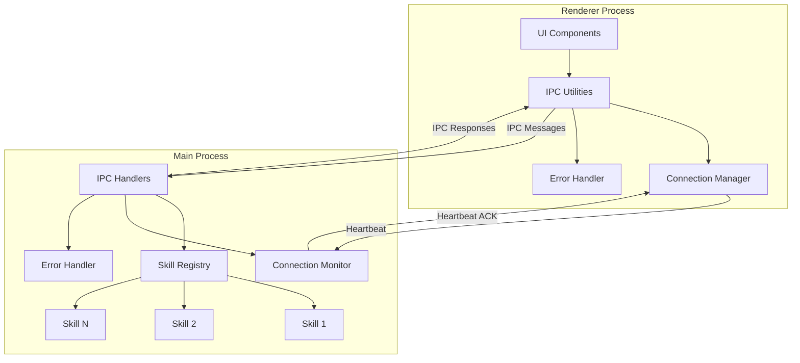
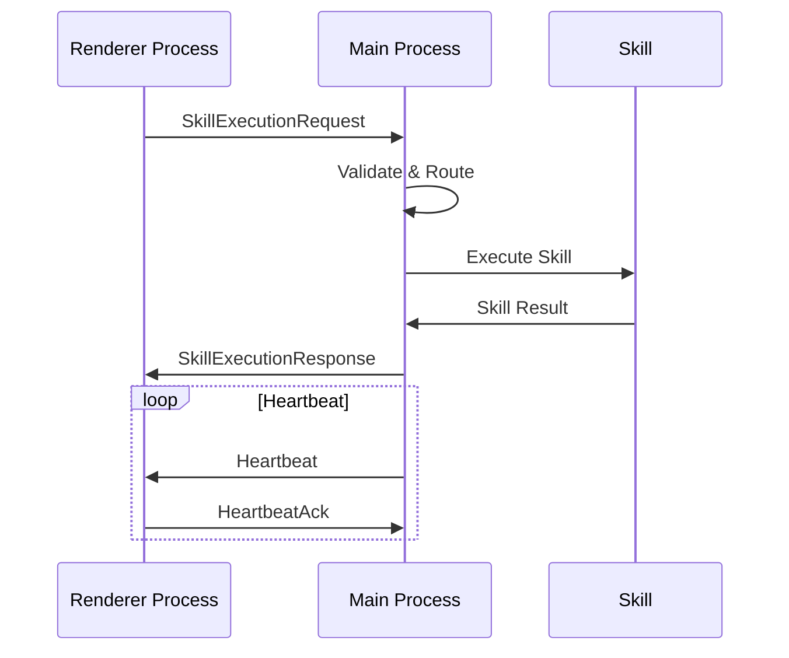

# Windows Troubleshooting Companion - IPC Architecture

## Overview

This document describes the Inter-Process Communication (IPC) architecture between the Electron main process and renderer process for the Windows Troubleshooting Companion. The architecture is designed to be scalable, secure, and follows best practices for Electron applications.

## Architecture Diagram



## Message Flow



## File Structure

```
src/
├── types/
│   └── ipc.ts                 # Core type definitions and constants
├── ipc/
│   ├── index.ts              # Main exports
│   ├── mainHandlers.ts       # Main process IPC handlers
│   ├── rendererUtilities.ts  # Renderer process IPC utilities
│   ├── errorHandling.ts      # Error handling and utilities
│   ├── connectionManager.ts  # Connection state management
│   └── usageExamples.ts      # Usage examples and patterns
```

## Core Components

### 1. Type Definitions (`src/types/ipc.ts`)

- **IPCMessageBase**: Base interface for all IPC messages
- **SkillExecutionRequest/Response**: Skill execution messages matching PRD format
- **ConnectionStateMessage**: Connection status updates
- **Heartbeat messages**: Connection health monitoring
- **IPC_CHANNELS**: All defined IPC channels
- **IPC_ERROR_CODES**: Standardized error codes
- **IPC_CONFIG**: Configuration constants

### 2. Main Process Handlers (`src/ipc/mainHandlers.ts`)

- **Skill registry**: Register/unregister skill handlers
- **Request validation**: Message structure validation
- **Timeout handling**: Automatic request timeout management
- **Heartbeat system**: Connection health monitoring
- **Connection state management**: Track renderer process state

### 3. Renderer Process Utilities (`src/ipc/rendererUtilities.ts`)

- **Request/response pattern**: Type-safe message sending
- **Pending request tracking**: Manage in-flight requests
- **Event listeners**: Subscribe to IPC messages
- **Connection initialization**: Establish connection to main process
- **Automatic cleanup**: Handle process lifecycle events

### 4. Error Handling (`src/ipc/errorHandling.ts`)

- **IPCError class**: Standardized error handling
- **Retry mechanism**: Exponential backoff with jitter
- **Timeout wrapper**: Async operation timeout management
- **Safe parsing**: Message validation utilities
- **Error logging**: Structured error logging

### 5. Connection Management (`src/ipc/connectionManager.ts`)

- **State tracking**: Connection status monitoring
- **Automatic reconnection**: Exponential backoff reconnection
- **Heartbeat monitoring**: Detect connection failures
- **Health checks**: Connection availability checking
- **Event-based notifications**: State change events

## IPC Channels

| Channel | Direction | Purpose |
|---------|-----------|---------|
| `skill-execution-request` | Renderer → Main | Request skill execution |
| `skill-execution-response` | Main → Renderer | Skill execution result |
| `connection-state` | Main → Renderer | Connection status updates |
| `heartbeat` | Main → Renderer | Connection health check |
| `heartbeat-ack` | Renderer → Main | Heartbeat acknowledgment |
| `ipc-error` | Both directions | Error messages |
| `ipc-log` | Both directions | Log messages |
| `ipc-ping` | Renderer → Main | Connection initialization |
| `ipc-pong` | Main → Renderer | Connection acknowledgment |

## Message Schema Examples

### Skill Execution Request
```json
{
  "type": "skill_execution_request",
  "messageId": "uuid",
  "timestamp": 1234567890,
  "skillId": "wifi_reset",
  "params": {},
  "requiresAdmin": true,
  "timeoutMs": 30000
}
```

### Skill Execution Response
```json
{
  "type": "skill_execution_response",
  "messageId": "uuid",
  "timestamp": 1234567890,
  "correlationId": "request-uuid",
  "skillId": "wifi_reset",
  "status": "success",
  "output": "Wi-Fi adapter reset successfully",
  "executionTimeMs": 150
}
```

### Error Response
```json
{
  "type": "skill_execution_response",
  "messageId": "uuid",
  "timestamp": 1234567890,
  "correlationId": "request-uuid",
  "skillId": "wifi_reset",
  "status": "error",
  "error": {
    "code": "SKILL_NOT_FOUND",
    "message": "Skill 'wifi_reset' not found",
    "details": null
  }
}
```

## Security Considerations

1. **Message Validation**: All messages are validated for proper structure
2. **Skill Sandboxing**: Skills run in isolated environments
3. **Timeout Protection**: Prevents hung operations
4. **Connection Security**: Heartbeat monitoring detects connection issues
5. **Error Isolation**: Errors are contained and properly handled

## Performance Characteristics

- **Message Size**: Typically <1KB per message
- **Latency**: <10ms for local IPC
- **Throughput**: Supports hundreds of concurrent requests
- **Memory**: Minimal overhead (<5MB for IPC system)
- **CPU**: Low utilization (<1% during idle)

## Error Handling Strategy

1. **Retryable Errors**: Timeouts, temporary connection issues
2. **Non-Retryable Errors**: Invalid requests, skill not found
3. **Circuit Breaker**: Automatic backoff on repeated failures
4. **Graceful Degradation**: Continue operation when possible

## Monitoring and Logging

- **Connection state**: Track connection health
- **Message metrics**: Count requests, responses, errors
- **Performance metrics**: Track execution times
- **Error rates**: Monitor failure rates
- **Queue depth**: Monitor pending requests

## Scalability Features

1. **Request Batching**: Support for batch operations
2. **Connection Pooling**: Multiple renderer process support
3. **Load Balancing**: Distribute requests across skills
4. **Rate Limiting**: Prevent abuse
5. **Priority Queuing**: Handle urgent requests first

## Testing Strategy

1. **Unit Tests**: Individual component testing
2. **Integration Tests**: Cross-process communication testing
3. **Load Tests**: High volume message testing
4. **Error Tests**: Failure scenario testing
5. **Performance Tests**: Latency and throughput testing

## Future Extensions

1. **Binary Data Support**: File transfers, screenshots
2. **Streaming Support**: Real-time progress updates
3. **Compression**: Message size optimization
4. **Encryption**: End-to-end message encryption
5. **Protocol Buffers**: Alternative serialization format

## Usage Examples

See `src/ipc/usageExamples.ts` for comprehensive usage patterns and examples.

## Dependencies

- **Electron**: IPC infrastructure
- **Node.js**: Crypto for UUID generation, timers
- **TypeScript**: Type safety and development experience

This architecture provides a robust foundation for the Windows Troubleshooting Companion's IPC needs, ensuring reliable communication between processes while maintaining security and performance.