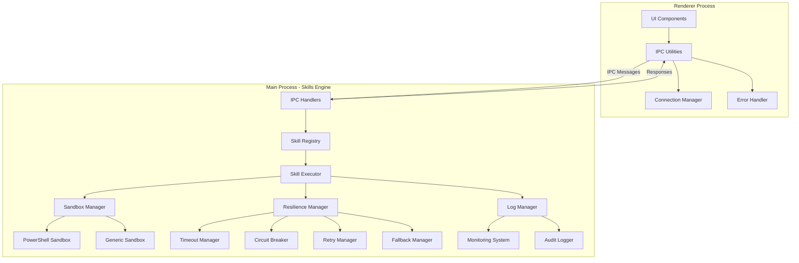

# Windows AI Troubleshooter - Skills Engine Documentation

## Table of Contents
1. [Architecture Overview](#architecture-overview)
2. [Component Documentation](#component-documentation)
3. [Security Features](#security-features)
4. [API Reference](#api-reference)
5. [Usage Guide](#usage-guide)
6. [Configuration Guide](#configuration-guide)
7. [Best Practices](#best-practices)
8. [Troubleshooting](#troubleshooting)
9. [Compliance](#compliance)
10. [Integration Guide](#integration-guide)

---

## Architecture Overview

### System Design
The Windows AI Troubleshooter Skills Engine is a robust, secure, and scalable system designed for enterprise-grade troubleshooting operations. The architecture follows a microservices-inspired pattern within a single Electron application, providing isolation, fault tolerance, and comprehensive monitoring.

### Core Components



### Data Flow
1. **Request Initiation**: UI components in renderer process send skill execution requests
2. **IPC Routing**: Messages are validated and routed through secure IPC channels
3. **Skill Execution**: Main process executes skills in isolated sandboxes
4. **Resilience Handling**: Comprehensive error handling and fault tolerance
5. **Response Processing**: Results are returned to renderer process
6. **Monitoring**: All operations are logged and monitored

---

## Component Documentation

### 1. IPC Communication System (`src/ipc/`)

#### Main Process Handlers (`mainHandlers.ts`)
- **Skill Registry**: Dynamic registration and management of skill handlers
- **Message Validation**: Comprehensive validation of all IPC messages
- **Timeout Management**: Automatic request timeout handling (30s default)
- **Connection State**: Real-time connection health monitoring
- **Heartbeat System**: 5-second interval health checks

#### Renderer Utilities (`rendererUtilities.ts`)
- **Request/Response Pattern**: Type-safe message sending with correlation
- **Pending Request Tracking**: Manages in-flight requests with automatic cleanup
- **Connection Management**: Automatic reconnection with exponential backoff
- **Event Listeners**: Subscription-based message handling

### 2. PowerShell Sandbox (`src/skills-engine/powershell-sandbox.ts`)

#### Security Features
- **Execution Policy**: Configurable policies (Restricted, RemoteSigned, etc.)
- **Language Mode**: Constrained and Restricted language modes
- **Cmdlet Blocking**: Blocks 50+ dangerous PowerShell cmdlets
- **Output Analysis**: Real-time pattern detection for suspicious activity
- **Resource Limits**: CPU, memory, and execution time constraints

#### Configuration Options
```typescript
interface PowerShellSandboxOptions {
  executionPolicy?: 'Restricted' | 'AllSigned' | 'RemoteSigned' | 'Unrestricted' | 'Bypass';
  noProfile?: boolean;
  noLogo?: boolean;
  restrictedLanguageMode?: boolean;
  constraintMode?: boolean;
  encodedCommand?: boolean;
}
```

### 3. Generic Sandbox (`src/skills-engine/sandbox.ts`)

#### Supported Script Types
- PowerShell (`.ps1`)
- Shell scripts (`.sh`)
- Batch files (`.bat`)
- Python scripts (`.py`)

#### Resource Limits
```typescript
interface ResourceLimits {
  maxCpuPercentage?: number;      // Default: 50%
  maxMemoryBytes?: number;        // Default: 100MB
  maxExecutionTimeMs?: number;    // Default: 30 seconds
  maxDiskWriteBytes?: number;     // Default: 10MB
  maxNetworkBytes?: number;       // Default: 1MB
}
```

### 4. Resilience System (`src/skills-engine/resilience-manager.ts`)

#### Core Components
- **Timeout Manager**: Multi-level timeout protection
- **Circuit Breaker**: Fault tolerance with automatic recovery
- **Retry Manager**: Exponential backoff with jitter
- **Fallback Manager**: Graceful degradation strategies
- **Error Reporter**: Comprehensive error diagnostics
- **Resource Cleaner**: Automated resource leak prevention
- **Error Hooks**: Extensible error handling pipeline

### 5. Logging & Monitoring (`src/skills-engine/logging/`)

#### Log Manager Features
- **Structured Logging**: JSON-formatted logs with rich context
- **Multiple Destinations**: Console, file, and external systems
- **Search & Analytics**: Full-text search and statistical analysis
- **Performance Metrics**: Execution times, success rates, error distribution
- **Security Auditing**: Comprehensive security event tracking

#### Monitoring Integration
- Real-time dashboard metrics
- Historical performance analysis
- Error rate monitoring
- Resource usage tracking
- Security event correlation

---

## Security Features

### 1. Sandbox Isolation
- **Process Isolation**: Each skill runs in separate child processes
- **Resource Constraints**: Strict CPU, memory, and time limits
- **Filesystem Restrictions**: Whitelisted directory access only
- **Network Controls**: Configurable network access policies

### 2. PowerShell Security
```powershell
# Blocked dangerous cmdlets include:
Invoke-Expression, Invoke-Command, Start-Process
New-Object, Add-Type, Set-ExecutionPolicy
Remove-Item, Rename-Item, Move-Item, Copy-Item
Invoke-WebRequest, Invoke-RestMethod
Get-WmiObject, Get-CimInstance
# ... and 40+ additional dangerous operations
```

### 3. Input Validation
- **Message Structure**: All IPC messages are rigorously validated
- **Parameter Sanitization**: Input parameters are sanitized before execution
- **Script Validation**: Skills are validated against security policies
- **Output Filtering**: Potentially dangerous output is filtered

### 4. Audit Logging
- **Execution Tracking**: Every skill execution is logged with full context
- **Security Events**: Suspicious activities trigger immediate alerts
- **Compliance Logs**: GDPR, HIPAA, and other compliance requirements
- **Tamper Evidence**: Cryptographic hashing of critical logs

### 5. Access Controls
- **Admin Requirements**: Skills can require administrator privileges
- **User Context**: Execution in appropriate user security context
- **Permission Checks**: Runtime permission validation
- **Role-Based Access**: Integration with enterprise RBAC systems

---

## API Reference

### IPC API (`src/types/ipc.ts`)

#### Message Types
```typescript
// Skill Execution Request
interface SkillExecutionRequest {
  type: 'skill_execution_request';
  messageId: string;
  timestamp: number;
  skillId: string;
  params: Record<string, any>;
  requiresAdmin?: boolean;
  timeoutMs?: number;
}

// Skill Execution Response
interface SkillExecutionResponse {
  type: 'skill_execution_response';
  messageId: string;
  timestamp: number;
  correlationId: string;
  skillId: string;
  status: 'success' | 'error' | 'timeout' | 'cancelled';
  output?: string;
  error?: {
    code: string;
    message: string;
    details?: any;
  };
  executionTimeMs?: number;
}
```

#### Channels
```typescript
export const IPC_CHANNELS = {
  SKILL_EXECUTION_REQUEST: 'skill-execution-request',
  SKILL_EXECUTION_RESPONSE: 'skill-execution-response',
  CONNECTION_STATE: 'connection-state',
  HEARTBEAT: 'heartbeat',
  HEARTBEAT_ACK: 'heartbeat-ack',
  ERROR: 'ipc-error',
  LOG: 'ipc-log',
  PING: 'ipc-ping',
  PONG: 'ipc-pong',
} as const;
```

### Sandbox API

#### PowerShell Sandbox
```typescript
const sandbox = new PowerShellSandbox(scriptPath, {
  executionPolicy: 'Restricted',
  noProfile: true,
  restrictedLanguageMode: true
});

const result = await sandbox.execute(args);
// Returns: { exitCode, stdout, stderr, executionTimeMs, securityEvents }
```

#### Generic Sandbox
```typescript
const sandbox = new SkillSandbox(scriptPath, 'powershell', {
  resourceLimits: {
    maxMemoryBytes: 50 * 1024 * 1024, // 50MB
    maxExecutionTimeMs: 15000 // 15 seconds
  }
});

const result = await sandbox.execute(args);
```

### Resilience API

#### Basic Usage
```typescript
const resilienceManager = createResilienceManager(errorHandler);

const result = await resilienceManager.executeWithResilience(
  async () => {
    return await executeSkill('wifi-reset');
  },
  {
    operationName: 'wifi-reset-operation',
    circuitName: 'wifi-circuit',
    timeoutLevel: 'execution',
    retryStrategy: { maxAttempts: 2 },
    fallbackStrategy: {
      strategy: 'defaultValue',
      defaultValue: 'fallback-completed'
    }
  }
);
```

---

## Usage Guide

### 1. Skill Development

#### Skill Metadata (`skills/wifi-reset.json`)
```json
{
  "id": "wifi-reset",
  "name": "Wi-Fi Adapter Reset",
  "description": "Resets Wi-Fi network adapter",
  "os": ["windows"],
  "riskLevel": "medium",
  "requiresAdmin": true,
  "script": "wifi-reset.ps1",
  "version": "1.0.0",
  "parameters": [],
  "output": {
    "success": "Wi-Fi adapter reset successfully",
    "failure": "Failed to reset Wi-Fi adapter"
  }
}
```

#### PowerShell Script (`skills/wifi-reset.ps1`)
```powershell
try {
    $adapter = Get-NetAdapter -Name "Wi-Fi" -ErrorAction Stop
    if ($adapter.Status -eq "Disabled") {
        Enable-NetAdapter -Name "Wi-Fi" -Confirm:$false
        Write-Output "SUCCESS: Wi-Fi adapter enabled"
    } else {
        Write-Output "INFO: Wi-Fi adapter already enabled"
    }
} catch {
    Write-Output "ERROR: $($_.Exception.Message)"
    exit 1
}
```

### 2. Skill Registration

#### Main Process Setup
```typescript
import { registerSkill } from './ipc/mainHandlers';
import { PowerShellSandbox } from './skills-engine/powershell-sandbox';

// Register a skill handler
registerSkill('wifi-reset', async (params) => {
  const scriptPath = path.join(__dirname, 'skills', 'wifi-reset.ps1');
  const sandbox = new PowerShellSandbox(scriptPath, {
    executionPolicy: 'RemoteSigned',
    noProfile: true
  });

  const result = await sandbox.execute();

  if (result.exitCode === 0) {
    return result.stdout;
  } else {
    throw new Error(result.stderr);
  }
});

// Initialize IPC handlers
initializeIPCHandlers();
```

### 3. Client-Side Usage

#### Renderer Process
```typescript
import { executeSkill, initializeConnection } from './ipc/rendererUtilities';

// Initialize connection
await initializeConnection();

// Execute skill
try {
  const response = await executeSkill('wifi-reset', {}, {
    timeoutMs: 15000,
    requiresAdmin: true
  });

  if (response.status === 'success') {
    console.log('Skill executed successfully:', response.output);
  } else {
    console.error('Skill failed:', response.error?.message);
  }
} catch (error) {
  console.error('Execution error:', error.message);
}
```

### 4. Error Handling

#### Comprehensive Error Management
```typescript
import { addConnectionStateListener } from './ipc/rendererUtilities';

// Listen for connection state changes
const removeListener = addConnectionStateListener((message) => {
  console.log('Connection state:', message.state);
  if (message.state === 'disconnected') {
    // Handle reconnection logic
    attemptReconnection();
  }
});

// Clean up listener when done
// removeListener();
```

---

## Configuration Guide

### 1. IPC Configuration (`src/types/ipc.ts`)

```typescript
export const IPC_CONFIG = {
  DEFAULT_TIMEOUT_MS: 30000,       // 30 seconds
  HEARTBEAT_INTERVAL_MS: 5000,     // 5 seconds
  MAX_RETRY_ATTEMPTS: 3,           // Maximum retry attempts
  CONNECTION_TIMEOUT_MS: 10000,    // 10 second connection timeout
} as const;
```

### 2. Sandbox Configuration

#### PowerShell Sandbox Defaults
```typescript
const defaultOptions = {
  executionPolicy: 'Restricted',
  noProfile: true,
  noLogo: true,
  restrictedLanguageMode: true,
  constraintMode: true,
  encodedCommand: false
};
```

#### Resource Limits Defaults
```typescript
const defaultResourceLimits = {
  maxCpuPercentage: 50,
  maxMemoryBytes: 100 * 1024 * 1024,    // 100MB
  maxExecutionTimeMs: 30000,            // 30 seconds
  maxDiskWriteBytes: 10 * 1024 * 1024,  // 10MB
  maxNetworkBytes: 1024 * 1024          // 1MB
};
```

### 3. Resilience Configuration

#### Timeout Levels
```typescript
const timeoutLevels = {
  global: 60000,       // 60 seconds - Entire operation
  execution: 30000,    // 30 seconds - Individual execution
  resource: 10000,     // 10 seconds - Resource operations
  cleanup: 5000,       // 5 seconds - Cleanup operations
};
```

#### Circuit Breaker Settings
```typescript
const circuitBreakerDefaults = {
  failureThreshold: 5,     // Failures before opening circuit
  successThreshold: 3,     // Successes before closing circuit
  timeoutMs: 30000,        // Time in open state
  resetTimeoutMs: 60000,   // Time before attempting reset
};
```

### 4. Logging Configuration

#### Log Levels
```typescript
const logLevels = {
  debug: process.env.DEBUG === 'true',
  info: true,
  warn: true,
  error: true,
  fatal: true,
  audit: true
};
```

#### Log Destinations
```typescript
const logDestinations = [
  { type: 'console', level: 'info' },
  { type: 'file', path: '/logs/app.log', level: 'debug' },
  { type: 'elasticsearch', url: process.env.ELASTIC_URL, level: 'error' }
];
```

---

## Best Practices

### 1. Security Best Practices

#### Skill Development
- **Minimal Privileges**: Request only necessary permissions
- **Input Validation**: Validate all parameters before use
- **Output Sanitization**: Filter sensitive information from outputs
- **Error Handling**: Provide clear, non-sensitive error messages
- **Resource Cleanup**: Ensure proper cleanup of temporary resources

#### Sandbox Configuration
```typescript
// Recommended security settings
const secureConfig = {
  executionPolicy: 'Restricted',
  noProfile: true,
  restrictedLanguageMode: true,
  constraintMode: true,
  resourceLimits: {
    maxMemoryBytes: 50 * 1024 * 1024, // 50MB
    maxExecutionTimeMs: 15000,        // 15 seconds
    maxNetworkBytes: 0                // No network access
  }
};
```

### 2. Performance Best Practices

#### Efficient Skill Design
- **Short Execution Time**: Design skills to complete within 30 seconds
- **Minimal Resource Usage**: Use efficient algorithms and patterns
- **Batch Operations**: Combine related operations when possible
- **Caching**: Cache frequently accessed data when appropriate
- **Async Operations**: Use asynchronous patterns for I/O operations

#### Resilience Configuration
```typescript
// Optimal resilience settings
const resilienceConfig = {
  timeoutLevel: 'execution',      // Appropriate timeout level
  retryStrategy: {
    maxAttempts: 2,              // Limited retries
    initialDelayMs: 1000,        // 1 second initial delay
    backoffFactor: 2,            // Exponential backoff
    jitter: true                 // Prevent thundering herd
  },
  fallbackStrategy: {
    strategy: 'defaultValue',
    defaultValue: 'operation-failed'
  }
};
```

### 3. Reliability Best Practices

#### Error Handling
- **Graceful Degradation**: Provide fallback mechanisms
- **Circuit Breaking**: Prevent cascading failures
- **Retry Strategies**: Implement intelligent retry logic
- **Monitoring**: Comprehensive logging and alerting
- **Testing**: Thorough testing of error scenarios

#### Monitoring Configuration
```typescript
// Comprehensive monitoring
const monitoringConfig = {
  enablePerformanceMetrics: true,
  enableErrorTracking: true,
  enableSecurityAuditing: true,
  enableResourceMonitoring: true,
  retentionPeriodDays: 30        // 30-day log retention
};
```

---

## Troubleshooting

### Common Issues and Solutions

#### 1. Skill Execution Failures

**Issue**: "Skill not found" error
**Solution**: Ensure skill is properly registered in main process

**Issue**: Permission denied errors
**Solution**: Check `requiresAdmin` flag and user permissions

**Issue**: Timeout errors
**Solution**: Review skill execution time and adjust timeout settings

#### 2. IPC Connection Issues

**Issue**: Connection state stuck at "disconnected"
**Solution**: Check main process initialization and heartbeat system

**Issue**: Message timeouts
**Solution**: Verify IPC configuration and network conditions

**Issue**: Heartbeat failures
**Solution**: Investigate process health and resource constraints

#### 3. Performance Issues

**Issue**: High memory usage
**Solution**: Review resource limits and skill memory consumption

**Issue**: Slow skill execution
**Solution**: Optimize skill scripts and review execution environment

**Issue**: Connection latency
**Solution**: Check system load and network conditions

### Diagnostic Tools

#### Log Analysis
```bash
# Search for error logs
grep -r "ERROR" /logs/app.log

# Analyze performance metrics
grep -r "executionTimeMs" /logs/app.log | awk '{print $NF}' | sort -n

# Check security events
grep -r "securityEvent" /logs/security.log
```

#### Monitoring Commands
```typescript
// Get connection status
const status = getConnectionState();
console.log('Connection status:', status);

// Get performance metrics
const metrics = logManager.getPerformanceReport();
console.log('Success rate:', metrics.successRate);

// Check resilience statistics
const stats = resilienceManager.getResilienceStatistics();
console.log('Timeout rate:', stats.timeouts.rate);
```

---

## Compliance

### GDPR Compliance

#### Data Protection
- **Data Minimization**: Only collect necessary data for troubleshooting
- **Right to Access**: Provide access to stored troubleshooting data
- **Right to Erasure**: Implement data deletion mechanisms
- **Data Portability**: Export capabilities for user data

#### Implementation
```typescript
// GDPR-compliant logging
const gdprConfig = {
  anonymizeIPs: true,
  maskPersonalData: true,
  retentionPeriod: 30, // days
  auditLogging: true
};
```

### HIPAA Compliance

#### Protected Health Information (PHI)
- **Encryption**: Encrypt all sensitive data in transit and at rest
- **Access Controls**: Strict role-based access controls
- **Audit Logging**: Comprehensive audit trails for all operations
- **Business Associate Agreement**: Ensure vendor compliance

#### Security Controls
```typescript
// HIPAA security settings
const hipaaConfig = {
  encryption: {
    enabled: true,
    algorithm: 'AES-256-GCM',
    keyManagement: 'HSM'
  },
  accessControl: {
    requireMFA: true,
    sessionTimeout: 900000 // 15 minutes
  },
  auditLogging: {
    enabled: true,
    retention: 365 // days
  }
};
```

### SOC2 Compliance

#### Trust Services Criteria
- **Security**: Protect against unauthorized access
- **Availability**: Ensure system availability and performance
- **Processing Integrity**: Ensure accurate and complete processing
- **Confidentiality**: Protect confidential information
- **Privacy**: Protect personal information

#### Compliance Measures
- Regular security audits and penetration testing
- Comprehensive incident response procedures
- Employee security training and awareness
- Vendor risk management processes
- Continuous monitoring and improvement

### ISO27001 Compliance

#### Information Security Management
- **Risk Assessment**: Regular security risk assessments
- **Security Controls**: Implement ISO27001 Annex A controls
- **Continuous Improvement**: Regular reviews and updates
- **Documentation**: Comprehensive security documentation

#### Certification Preparation
- Develop Information Security Management System (ISMS)
- Conduct internal audits and management reviews
- Implement corrective and preventive actions
- Prepare for external certification audit

---

## Integration Guide

### 1. External Monitoring Integration

#### Elasticsearch Integration
```typescript
// Elasticsearch log destination
const esConfig = {
  type: 'elasticsearch',
  node: process.env.ELASTICSEARCH_URL,
  index: 'wtc-logs-{date}',
  auth: {
    username: process.env.ELASTIC_USER,
    password: process.env.ELASTIC_PASSWORD
  }
};
```

#### Prometheus Metrics
```typescript
// Prometheus metrics endpoint
const prometheusConfig = {
  port: 9090,
  path: '/metrics',
  collectDefaultMetrics: true,
  customMetrics: [
    'skill_execution_time_seconds',
    'skill_success_rate',
    'ipc_message_latency_seconds'
  ]
};
```

### 2. Enterprise System Integration

#### Active Directory Integration
```typescript
// AD integration for authentication
const adConfig = {
  url: process.env.AD_URL,
  baseDN: process.env.AD_BASE_DN,
  username: process.env.AD_USER,
  password: process.env.AD_PASSWORD,
  groupFilter: '(memberOf=CN=WTC-Users,OU=Groups,DC=domain,DC=com)'
};
```

#### ITSM Integration (ServiceNow, Jira)
```typescript
// ServiceNow integration
const serviceNowConfig = {
  instance: process.env.SERVICENOW_INSTANCE,
  username: process.env.SERVICENOW_USER,
  password: process.env.SERVICENOW_PASSWORD,
  table: 'incident',
  assignmentGroup: 'IT Support'
};
```

### 3. Cloud Integration

#### AWS Integration
```typescript
// AWS CloudWatch logging
const cloudwatchConfig = {
  logGroupName: '/aws/wtc/logs',
  logStreamName: 'application',
  region: process.env.AWS_REGION,
  credentials: {
    accessKeyId: process.env.AWS_ACCESS_KEY,
    secretAccessKey: process.env.AWS_SECRET_KEY
  }
};
```

#### Azure Integration
```typescript
// Azure Monitor integration
const azureConfig = {
  resourceId: process.env.AZURE_RESOURCE_ID,
  instrumentationKey: process.env.APPINSIGHTS_INSTRUMENTATIONKEY,
  logLevel: 'Information'
};
```

### 4. Custom Integration Examples

#### Custom Log Destination
```typescript
// Custom log destination implementation
class CustomLogDestination {
  async write(logEntry: any) {
    // Custom logging logic
    await sendToCustomSystem(logEntry);
  }

  async flush() {
    // Flush buffered logs
  }
}

// Register custom destination
logManager.addDestination(new CustomLogDestination());
```

#### Custom Resilience Strategy
```typescript
// Custom fallback strategy
class CustomFallbackStrategy implements FallbackStrategy {
  async execute(failedOperation: () => Promise<any>, context: any) {
    // Custom fallback logic
    try {
      return await alternativeOperation();
    } catch (error) {
      // Secondary fallback
      return defaultValue;
    }
  }
}

// Register custom strategy
resilienceManager.registerFallbackStrategy('custom', new CustomFallbackStrategy());
```

---

## Support and Maintenance

### Support Channels
- **Documentation**: This comprehensive guide
- **Issue Tracking**: GitHub issues repository
- **Community Support**: Developer forums and Discord
- **Enterprise Support**: SLA-based support contracts

### Maintenance Procedures

#### Regular Maintenance
```bash
# Log rotation
npm run logs:rotate

# Database cleanup
npm run db:cleanup

# Security updates
npm run security:scan
```

#### Monitoring Health Checks
```typescript
// Health check endpoint
app.get('/health', async (req, res) => {
  const health = await logManager.healthCheck();
  res.json(health);
});

// Metrics endpoint
app.get('/metrics', async (req, res) => {
  const metrics = logManager.getPerformanceReport();
  res.json(metrics);
});
```

### Upgrade Procedures

#### Version Compatibility
- **Backward Compatibility**: IPC protocols maintain backward compatibility
- **Configuration Migration**: Automated configuration migration tools
- **Skill Validation**: Version-specific skill validation
- **Rollback Procedures**: Documented rollback procedures

#### Upgrade Checklist
1. Backup current configuration and data
2. Review release notes and breaking changes
3. Test upgrade in staging environment
4. Deploy to production with monitoring
5. Validate all skills and integrations
6. Update documentation and runbooks

---

## Conclusion

This documentation provides comprehensive guidance for the Windows AI Troubleshooter Skills Engine implementation. The system is designed for enterprise-grade reliability, security, and scalability, with extensive features for fault tolerance, monitoring, and integration.

For additional support, refer to the source code documentation, API references, and community resources. Regular updates and security patches ensure the system remains robust and compliant with evolving standards.